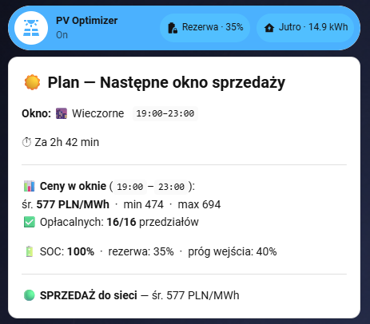

# PV Smart Battery Optimizer for Home Assistant
[](https://github.com/hacs/integration)
[](LICENSE)
[](https://www.home-assistant.io)
A pair of HA blueprints that dynamically control your solar inverter's work mode
(sell to grid vs. self-use / charge) using:
- 📈 **Spot electricity price** — only sells when profitable
- ⏰ **Configurable sell windows** — morning peak + evening peak (avoids overnight HP hours)
- 🔋 **Dynamic battery reserve SOC** — computed nightly from tomorrow's forecast consumption vs. PV production; never drains the battery below what's needed overnight
- 🌡️ **Weather-aware consumption model** — linear heat-pump model calibrated from real Daikin Altherma data
- 🔴 **Master on/off switch** — kill switch that reverts to safe mode instantly
---
## How it works
```
00:30 daily  →  [Blueprint 1] fetch PirateWeather forecast
                              compute effective temp (75% low + 25% high)
                              store → input_number.pv_optimizer_temperature_tomorrow
every 15 min →  [Blueprint 2] read price sensor, battery SOC, PV forecast
                              compute consumption estimate:
                                total = base_load + hp_coeff × max(0, balance_point − temp)
                              compute reserve SOC:
                                reserve = inverter_floor + gap_kWh/capacity×100 + buffer
                              decide:
                                if OFF switch  → Zero Export To Load  🔴
                                elif in window AND price > min AND SOC ≥ reserve
                                               → Export First          ☀️
                                else           → Zero Export To Load   🔋
```
### Reserve SOC formula
```
gap_kWh  = max(0, tomorrow_consumption − tomorrow_pv_forecast)
reserve  = inverter_floor + (gap_kWh / battery_capacity × 100) + safety_buffer
reserve  = clamp(reserve, min_soc_floor, 95)
```
The inverter never drains below its hardware floor (`inverter_floor`).  
Only energy **above** that floor is realistically usable overnight.  
Adding `inverter_floor` into the formula ensures the reserve SOC correctly
reflects where the battery will sit after covering the overnight gap.
### Consumption model
```
daily_consumption = base_load + hp_coeff × max(0, balance_point − temp_effective)
temp_effective    = 0.75 × forecast_low + 0.25 × forecast_high
```
| Parameter | Default | Notes |
|---|---|---|
| `base_load` | 6.5 kWh | Appliances + constant DHW. Measure on warm days (>20 °C). |
| `hp_coeff` | 0.7 kWh/°C | Calibrated on Daikin Altherma EHVH08S23EJ9W. **Set to 0 if no HP.** |
| `balance_point` | 18 °C | Altherma weatherDependent threshold. Typical 15–20 °C. |
| Low weight | 0.75 | HP runs mostly 00:00–08:00 — night lows dominate demand. |
| High weight | 0.25 | Daytime highs have smaller effect on HP electricity use. |
---
## Prerequisites
| What | Why |
|---|---|
| Home Assistant 2024.1+ | Blueprint features, `action:` key |
| **Inverter** with a `select` entity for work mode | e.g. Solarman/Deye via [ha-solarman](https://github.com/StephanJoubert/home_assistant_solarman) |
| **Battery SOC sensor** (sensor, %) | e.g. `sensor.solarman_battery` |
| **Spot price sensor** | e.g. RCE/PSE integration, Nordpool, Tibber |
| **PV forecast sensor** (kWh) | e.g. [Solcast](https://github.com/BJReplay/ha-solcast-solar) |
| **Battery capacity sensor** (kWh) | e.g. `sensor.solarman_battery_capacity` |
| **Inverter min SOC number entity** | e.g. `number.solarman_battery_restart_soc` |
| **Weather entity** with daily forecast | e.g. [PirateWeather](https://github.com/alexander0042/pirate-weather-ha) |
---
## Installation
### Option A — HACS (recommended)
> Requires [HACS](https://hacs.xyz) installed.
1. Open HACS → **Blueprints** (or use "Custom repositories")
2. Add custom repository: `https://github.com/mlabuda2/ha_pv_optimizer`  → category **Blueprint**
3. Download both blueprints
### Option B — Manual blueprint import
Click the buttons below to import directly:
**Blueprint 1 — Fetch Tomorrow's Temperature**

<a href="https://my.home-assistant.io/redirect/blueprint_import/?blueprint_url=https%3A%2F%2Fgithub.com%2Fmlabuda2%2Fha_pv_optimizer%2Fblob%2Fmain%2Fblueprints%2Fautomation%2Fpv_optimizer%2Fpv_optimizer_fetch_temperature.yaml">
  
</a>

**Blueprint 2 — Smart Battery Controller**

<a href="https://my.home-assistant.io/redirect/blueprint_import/?blueprint_url=https%3A%2F%2Fgithub.com%2Fmlabuda2%2Fha_pv_optimizer%2Fblob%2Fmain%2Fblueprints%2Fautomation%2Fpv_optimizer%2Fpv_optimizer_controller.yaml">
  
</a>

---

## Setup
### Step 1 — Create helpers manually
Go to **Settings → Helpers** and create:
| Helper | Type | Range | Initial |
|---|---|---|---|
| `PV Optimizer — Enabled` | Toggle (input_boolean) | — | On |
| `PV Optimizer — Tomorrow's Temperature` | Number (input_number) | −30 to 40, step 0.1 °C | 10 |
| `PV Optimizer — Safety Buffer SOC` | Number (input_number) | 0–30, step 1 % | 15 |
| `PV Optimizer — Min SOC Before Selling` | Number (input_number) | 0–80, step 1 % | 20 |
> **Shortcut**: copy `packages/pv_optimizer.yaml` to your `config/packages/` folder
> and add `packages: !include_dir_named packages` to `configuration.yaml`.
> Restart HA — all helpers and the optional template sensors are created automatically.
### Step 2 — Create the temperature-fetch automation
Settings → Automations → **+ Create Automation** → **From a Blueprint**  
→ select **"PV Optimizer — Fetch Tomorrow's Temperature"**
| Field | Value |
|---|---|
| Weather Entity | Your weather integration (e.g. `weather.pirateweather`) |
| Temperature Storage Helper | The `input_number` created in Step 1 |
| Nighttime Low Weight | 0.75 (HP household) or 0.5 (no HP) |
| Daytime High Weight | 0.25 (HP household) or 0.5 (no HP) |
Save, then **Run** it once manually to populate the temperature.
### Step 3 — Create the controller automation
Settings → Automations → **+ Create Automation** → **From a Blueprint**  
→ select **"PV Optimizer — Smart Battery Controller"**
Configure every field (all have sensible defaults):
**Hardware entities** — set to your actual entity IDs  
**Inverter mode options** — exact option strings from your inverter's select entity  
**Sell windows** — default 07:00–10:00 and 19:00–23:00 (Polish RCE peak hours)  
**Consumption model** — set `hp_coeff = 0` if no heat pump  
**Safety buffer** — start with 15 %, increase if battery runs low  
**Notification service** — enter the suffix (e.g. `mobile_app_iphone_yourname`) or leave blank
Save and enable.
### Step 4 (optional) — Dashboard cards
Install [Bubble Card](https://github.com/Clooos/Bubble-Card) via HACS → Frontend.  
Copy the YAML from `dashboards/bubble_card_example.yaml` into a manual card.  
(Requires the `packages/pv_optimizer.yaml` template sensors.)

For the **Next Sell Window Plan** card, copy `dashboards/pv_plan_card.yaml` into a manual
markdown card placed below the Bubble Card. It shows a live forecast for the next sell window:
prices, battery SOC vs. reserve & sell-entry threshold, and a colour-coded sell/no-sell verdict.


---
## Calibration
### Heat pump coefficient (`hp_coeff`)
Collect 5–10 days of daily HP electricity data alongside daily mean outdoor temperature.
Fit: `hp_kwh ≈ base_load + hp_coeff × max(0, balance − T_mean)`.  
Winter coefficient is typically 10–20 % higher than spring/autumn due to defrost cycles.
### Seasonal inverter floor
Change `number.solarman_battery_restart_soc` (or equivalent) on your inverter:
- **Summer** (Apr–Sep): 20 % — PV reliably recharges overnight gap
- **Winter** (Oct–Mar): 30–40 % — HP runs harder, cloud risk higher
The optimizer reads this number live; no other changes needed.
### Safety buffer
Start at 15 %. If battery SOC hits the floor before 06:00 on cold mornings,
increase by 5 % steps until it stops happening.
---
## Tested hardware
| Component | Integration | Entity example |
|---|---|---|
| Deye/Solarman 5 kW hybrid inverter | [ha-solarman](https://github.com/StephanJoubert/home_assistant_solarman) | `select.solarman_work_mode` |
| Daikin Altherma EHVH08S23EJ9W | [Daikin](https://www.home-assistant.io/integrations/daikin/) | — |
| Solcast PV forecast | [ha-solcast-solar](https://github.com/BJReplay/ha-solcast-solar) | `sensor.solcast_pv_forecast_forecast_tomorrow` |
| PirateWeather | [pirate-weather-ha](https://github.com/alexander0042/pirate-weather-ha) | `weather.pirateweather` |
| Polish RCE market price | Custom REST sensor | `sensor.rce_pse_cena` |
---
## License
[Apache 2.0](LICENSE) — © 2026 Mateusz Labuda
